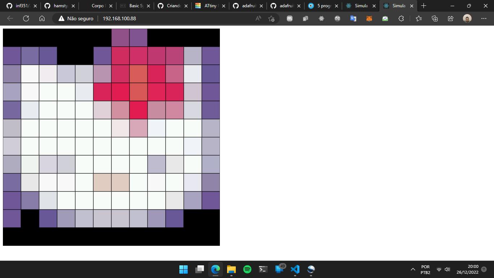

#Hello Kitty

## Introdução

Exemplo de uso do driver [Led_Table_NxN](https://github.com/hamsty/Led_Table_NxN) para desenhar imagens convertidas em binário usando o programa [Image2Bin](https://github.com/hamsty/Image2Bin/) por meio SPIFFS em uma ESP32.

## Build

Existem dois modos de build, um chamado mesa e o outro chamado virtual. O mesa configura o programa para rodar na mesa real, enquanto o virtual configura a mesa virtual (se for usar o virtual, não esqueça de mudar o login e a senha do seu WiFi).

## Imagens

### Original:

### Mesa Virtual

